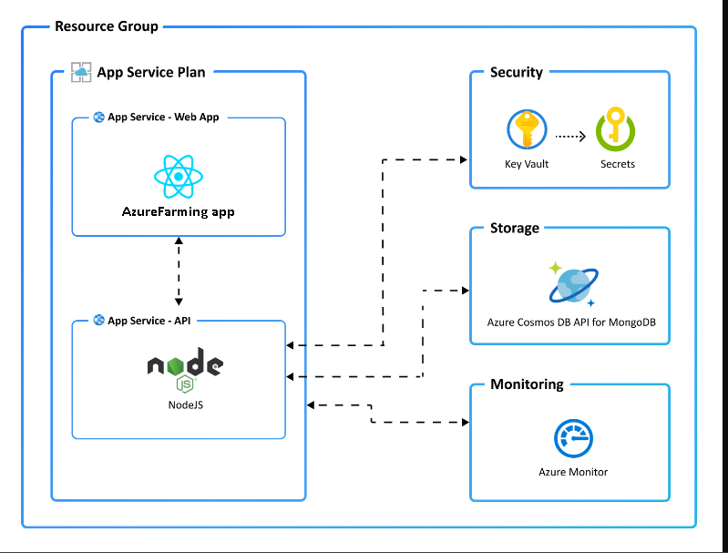

# AzureFarming API Backend with Node.js API and MongoDB (Terraform) on Azure
Here's a high level architecture diagram that illustrates these components. Notice that these are all contained within a single [resource group](https://docs.microsoft.com/azure/azure-resource-manager/management/manage-resource-groups-portal), that will be created for you when you create the resources.



AzureFarming API built with the following Azure ,services : 
languages:
- azdeveloper
- nodejs
- terraform
- typescript
- html

products:
- azure
- azure-cosmos-db
- azure-app-service
- azure-monitor
- azure-pipelines

### Prerequisites
> This template will create infrastructure and deploy code to Azure. If you don't have an Azure Subscription, you can sign up for a [free account here](https://azure.microsoft.com/free/). Make sure you have contributor role to the Azure subscription.

The following prerequisites are required to use this application. Please ensure that you have them all installed locally.

- [Azure Developer CLI](https://aka.ms/azd-install)
- [Node.js with npm (18.17.1+)](https://nodejs.org/) - for API backend and Web frontend
- [Terraform CLI](https://aka.ms/azure-dev/terraform-install)
    - Requires the [Azure CLI](https://learn.microsoft.com/cli/azure/install-azure-cli)

### Quickstart to deploy the AzureFarming API
This quickstart will show you how to authenticate on Azure, initialize using the code , provision infrastructure and deploy code on Azure via the following commands:

```bash
# Log in to azd. Only required once per-install.
azd auth login

# Provision and deploy to Azure
azd up

# Remove previously Provisioned objects from Azure 
azd down 

Note: if you modify or add services , functions to the current code base all you need to do is run your azd up command , not need for the azd down UNLESS you really want to clean up your deploy object/services from Azure 

Login Authentication using JWT, check under the infra/main.tf terraform file to see how the JWT seed is setup as an env variable for Azure deployment and you can change this 

```


## Source Code based from Azure template AZD/Terraform
If you wish to find out how to implement this templates you can follow this link:

- [Azure Template](docs/AzureTemplate.md)  - Azure Template guide


## API Endpoints

AzureFarming exposes the following API endpoints:.
when deploy the following URL will be use (this will change based on your system)
https://app-api-otdjotq2y2m1y.azurewebsites.net/
| HTTP|EndPoint | README |
| ------ | ------ | ------ |
|POST| api/users/register | [register user] (docs/API_Register.md) |
|POST| api/users/login | [login user] (docs/API_Login.md) |
|POST| api/users/logout | logout user [plugins/dropbox/README.md][PlDb] |
|POST| api/users/logoutall | logout user remove JWT [plugins/dropbox/README.md][PlDb] |
|GET| api/users/profile | [get user pofile] (docs/API_GETProfile.md) |
|PUT| api/users/profile | [update user profile] (docs/API_GETProfile.md) |


docs

## License
MIT
