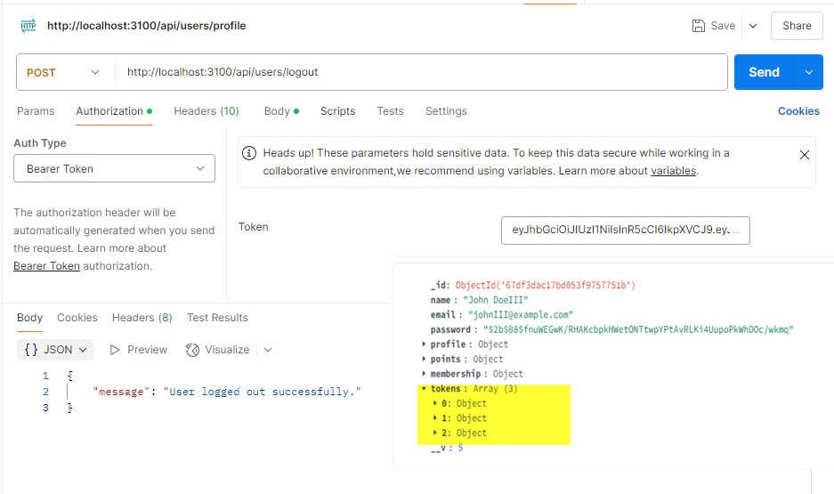

# BackEnd API POST Logout user 

https://app-api-otdjotq2y2m1y.azurewebsites.net/api/users/logout

To log out: POST http://localhost:3000/api/users/logout (Requires authentication)
Include the JWT token in the Authorization header as described above. 
Test it out yourself. Try to use the same token after logout and see what happens.

